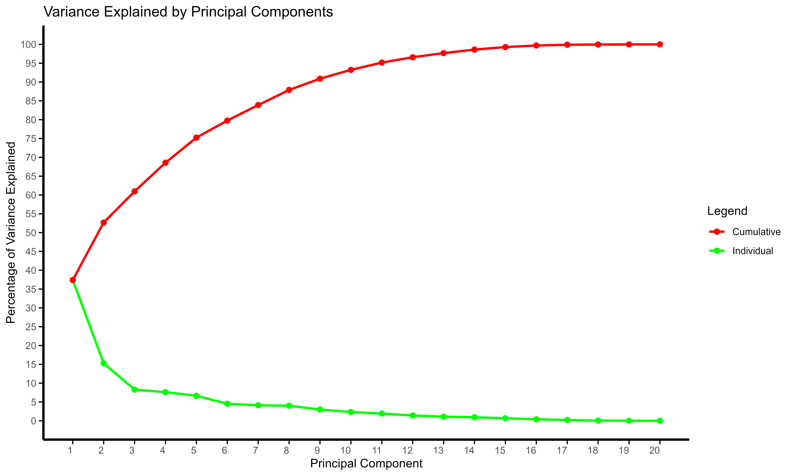
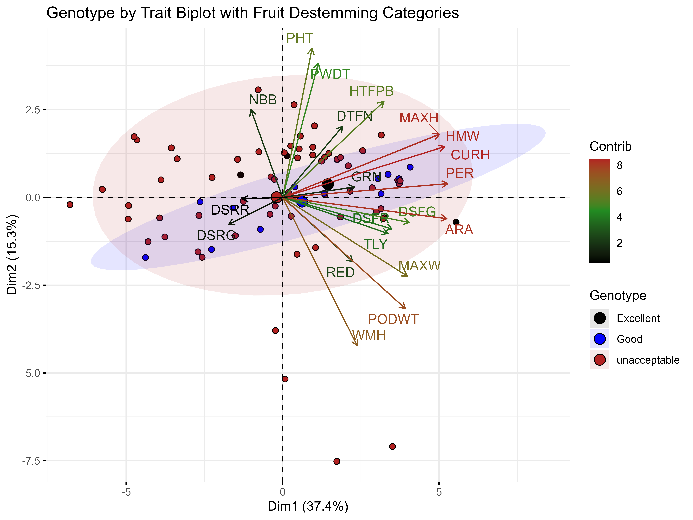

## Principal Component Analysis (PCA) of Phenotypic Data

This R script performs **Principal Component Analysis (PCA)** on phenotypic data to explore the underlying structure and relationships of traits across a set of genotypes.

---

### Workflow

1. **Load Libraries & Data**  
   Load required R packages (`FactoMineR`, `factoextra`, `missMDA`, `ggplot2`) and import the dataset containing adjusted means.

2. **Preprocessing**  
   Exclude the first column (typically genotype IDs) to focus on trait variables.

3. **PCA Computation**  
   Conduct PCA using the `PCA()` function from **FactoMineR**, with variables standardized to ensure comparability.

4. **Extract Results**  
   Key outputs are extracted and saved as CSV files for further analysis:  
   - Eigenvalues  
   - Trait contributions to principal components  
   - Loadings  
   - Correlation coefficients (R²)  
   - Eigenvectors  

---

### Visualizations

- **Scree Plot**  
  Displays the variance explained by each principal component, highlighting the most informative components.  

  

- **Genotype × Trait Biplot**  
  Illustrates the relationships between genotypes and traits, with contributions of each trait indicated by color or size.  

  

- **Cumulative Variance Plot**  
  Shows the proportion of variance explained cumulatively by the principal components, often integrated with the scree plot.

All visualizations are saved as **high-resolution PNG files** for publication or further analysis.

---

### Summary
This workflow provides a comprehensive approach to:  
- Understand the underlying structure of traits  
- Identify the most influential traits  
- Visualize genotype-trait relationships  
- Support downstream analyses such as clustering, GWAS interpretation, or breeding decisions

By combining numerical results and visualizations, users can gain deep insights into the phenotypic dataset.

